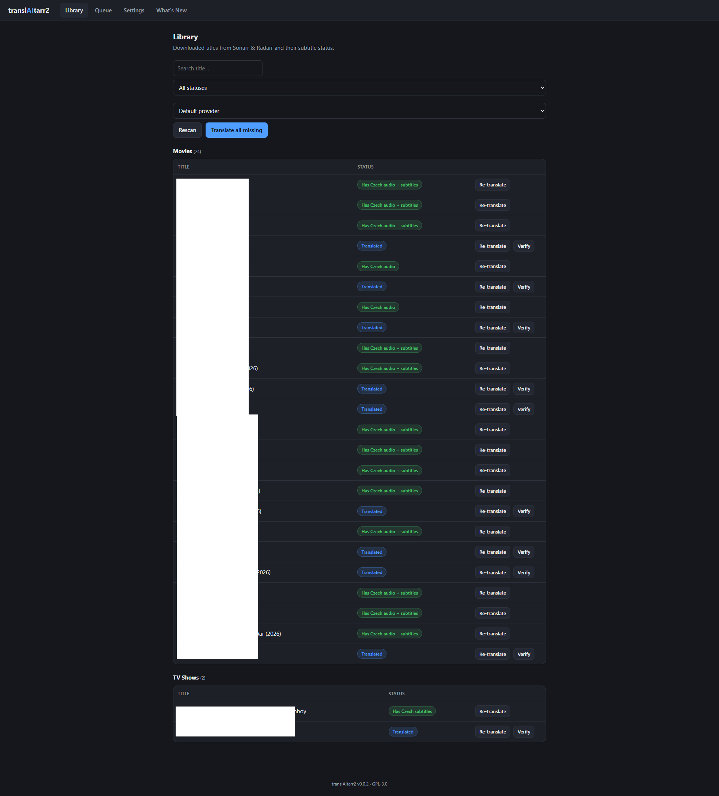
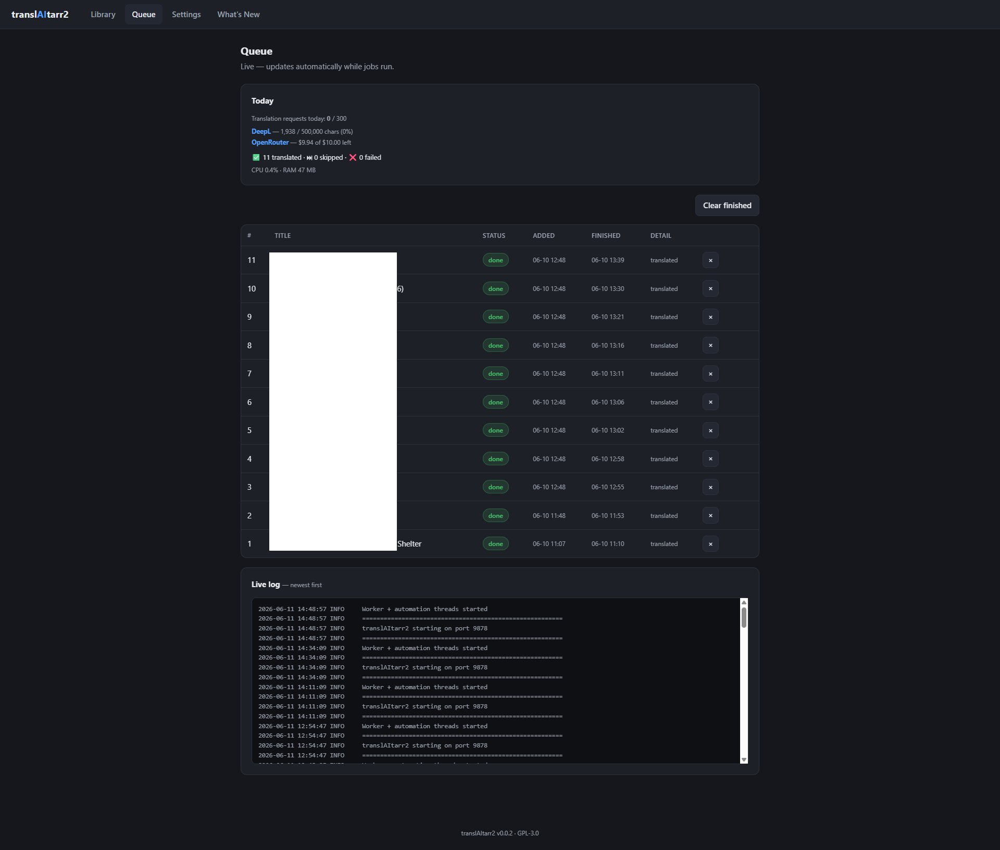
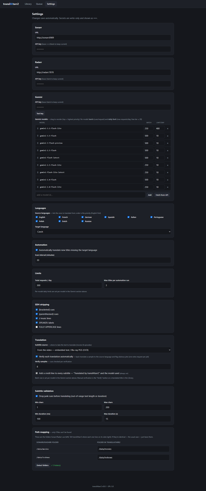

# translAItarr2

**AI subtitle translation for your media library — with a web UI and native Sonarr/Radarr integration.**

translAItarr2 watches your Sonarr/Radarr library, finds video files that don't yet
have a subtitle in your language, and translates one for them using the AI engine of
your choice — Google Gemini, OpenRouter, Anthropic Claude, Cloudflare Workers AI, a
local model (Ollama/LM Studio/…), DeepL, and more. Unlike most subtitle-translation
tools, it doesn't need a ready-made `.srt` lying around — it can **extract embedded
subtitles from the video** and even **OCR Blu-ray (PGS) bitmap subtitles** into text
before translating.

> Status: **actively developed** — usable day to day. Still pre-1.0, so the odd rough
> edge is possible, and this README grows as features land.

---

## Screenshots

| Library | Queue | Settings |
|---|---|---|
| [](docs/library.png) | [](docs/queue.png) | [](docs/settings.png) |

## Why another one?

Tools like [Bazarr](https://www.bazarr.media/) and
[Lingarr](https://github.com/lingarr-translate/lingarr) translate subtitle files
that already exist on disk. They can't help when the only English subtitle is
**embedded inside the MKV** or is a **PGS bitmap** (common on Blu-ray rips).
translAItarr2 handles those cases:

- ✅ Extracts and translates **embedded** text subtitles from the video
- ✅ **OCRs PGS** (Blu-ray bitmap) subtitles to text, then translates
- ✅ Skips files that **already have** your target language (audio, embedded sub, or sidecar)
- ✅ Picks the best source language by your configured priority (e.g. English first, then French, German, Spanish…)

## Features

- **Web UI (dark, minimal)** — Library (split into Movies / TV Shows), Queue, and Settings.
- **Native Sonarr/Radarr integration** via their REST API — real series / episode /
  movie titles, not raw file paths. **No webhook needed.** Path remapping is a guided
  table that auto-detects your *arr root folders.
- **First-run setup wizard** — connect Sonarr/Radarr (with Test buttons), add a
  translation provider (e.g. your Gemini key), pick source/target languages, optionally
  set a password. Nothing to hand-edit.
- **Smart source selection** — translate the subtitle **embedded in the video** (text
  or Blu-ray **PGS via OCR**), or prefer an **external source `.srt`** next to the file;
  picks the best source language by your configured priority.
- **Knows what a title already has** — skips files that already carry your target
  language and shows whether that's **audio (dub)**, **subtitles**, or both.
- **Your choice of translation engine — 12 providers** across LLMs (Gemini, OpenRouter,
  Anthropic Claude, Cloudflare Workers AI, and any OpenAI-compatible / local server such
  as Ollama, LM Studio, vLLM, Groq or DeepSeek) and dedicated machine translation (DeepL,
  LibreTranslate, Google, Microsoft/Azure, Yandex, Cloudflare m2m100, keyless Google).
  Pick a **primary plus two fallbacks** (fallback can cross providers), drag-reorder models
  per provider with **per-model batch size and daily request limit**, or **override the
  provider per job** from the Library. Tuned out of the box for Gemini's free tier.
- **Automation** — optional periodic scan that translates anything new; re-translate
  automatically on a release upgrade, or manually per-title.
- **Optional translation verification** — samples a finished translation and has the
  model check each line's meaning against the source, so it tolerates paraphrase and
  flags only genuinely wrong / untranslated lines; run it automatically or on demand.
  When something is flagged, the Queue shows the exact source → translation pairs so
  you can judge for yourself.
- **Quality options** — SDH/caption stripping, output sanity validation (drops junk
  cues), and a credit line on every file.
- **Live queue** — jobs, today's per-model usage, **per-provider usage where available**
  (DeepL characters left, OpenRouter credit), outcome tallies, container CPU/RAM and a live
  log, all auto-refreshing; Settings auto-save (no Save button).
- **Privacy & safety first** — secrets stay in your local config volume, redacted from
  logs; runs as a non-root user; in-app update check. The only thing that ever leaves your
  server is an **anonymous instance counter** (a random id + version, once a day) that you
  can [turn off](#privacy--telemetry) — it carries nothing about you or your library.

## Roadmap

Where things stand:

**Working now**
- Sonarr/Radarr library view with real titles, grouped into Movies / TV Shows
- Per-title, bulk and automatic translation; re-translate on release upgrade; manual re-translate
- **12 translation providers** (see [Translation providers](#translation-providers)) with
  cross-provider fallback, per-model batch sizes/daily limits, and a **per-job provider override**
- Embedded-subtitle extraction and PGS (Blu-ray) OCR
- Selectable source: translate the **video's embedded subtitle** or **prefer an external `.srt`** next to it
- Skip rules following your configured target language (shows whether a title already has target **audio**, **subtitles**, or both); SDH stripping; output validation
- Setup wizard, optional password, auto-saving settings, live queue (usage + per-provider usage + outcomes + CPU/RAM + log)
- Optional translation verification — model-judged so it tolerates paraphrase; automatic or on demand
- Path remapping (UI), in-app update check, multi-arch Docker image

**Planned (later)**
- **Per-provider system prompt / glossary** and **DeepL formality** (formal vs informal address) — for consistent names/terms across a series
- More dedicated MT engines on the same path (the plumbing is generic now)
- UI translations (i18n) — only if the community asks for it; then community-driven via Weblate (the app stays English-first, like Bazarr/Lingarr)

## Quick start

You don't need to clone this repo — the image is published to GitHub Container Registry.

**1.** Make a folder and create a `docker-compose.yaml` in it:

```yaml
services:
  translaitarr2:
    image: ghcr.io/trelowney/translaitarr2:latest
    container_name: translaitarr2
    environment:
      - PUID=1000           # your user id   (run `id` on the host to find yours)
      - PGID=1000           # your group id
      - TZ=Europe/Prague    # your timezone
    volumes:
      - ./config:/config            # settings, queue + your API keys — keep this private
      - /path/to/media:/data        # your media library (the files Sonarr/Radarr manage)
    ports:
      - 9878:9878
    restart: unless-stopped
```

**2.** Change the **media path** (`/path/to/media`) and the **PUID/PGID/TZ**, then start it:

```bash
docker compose up -d
```

**3.** Open **`http://<your-server-ip>:9878`** and follow the setup wizard. It walks you
through Sonarr/Radarr, your translation engine, and languages — **no config files to
hand-edit, and everything can be changed later in Settings.**

> **You enter your Sonarr/Radarr URLs + API keys and your AI provider in the wizard** — not
> in the compose file. translAItarr2 just needs to *reach* those APIs and *read* your media.
>
> **Already run an \*arr stack?** Drop this service into that stack's compose so it shares the
> Docker network, then use service names like `http://sonarr:8989` in the wizard. See
> [`docker-compose.example.yaml`](docker-compose.example.yaml) for that variant.

## Updating

Because the image is published to a registry, updating is the same as for any
*arr app — pull the newer image and recreate the container (your config in the
`/config` volume is untouched):

```bash
docker compose pull && docker compose up -d
```

**Automatic updates:** add [Watchtower](https://github.com/containrrr/watchtower)
to your stack (most *arr users already run it) and it will pull new releases and
recreate translAItarr2 for you — exactly like it does for Sonarr/Radarr:

```yaml
  watchtower:
    image: nickfedor/watchtower:latest
    environment:
      - WATCHTOWER_CLEANUP=true
      - WATCHTOWER_POLL_INTERVAL=3600
    volumes:
      - /var/run/docker.sock:/var/run/docker.sock
    restart: unless-stopped
```

Pin to a specific version (e.g. `image: ghcr.io/trelowney/translaitarr2:1.2.0`)
if you'd rather update deliberately instead of tracking `:latest`.

## Configuration

All settings are managed in the web UI (Settings tab) and persisted to
`config/config.json` in your mounted config volume. `config.example.json` documents
every field. Highlights:

| Area        | What it controls                                                        |
|-------------|-------------------------------------------------------------------------|
| Sonarr/Radarr | API URL + key for each (used to list the library with proper titles). |
| AI providers | Up to three priority slots (primary + 2 fallbacks) across 12 providers; per-provider keys and model lists. See [Translation providers](#translation-providers). |
| Languages   | Source-language priority order, and your single target language.        |
| SDH         | Strip captions/sound effects/speaker labels before translating.         |
| Limits      | Daily per-model and total request caps; max titles per automation run.  |
| Automation  | On/off and scan interval.                                               |
| Translation | Timeout, retries, context window, optional translator credit line.      |
| Validation  | Min/max cue length and duration sanity checks on the output.            |

### Translation providers

Configure providers under **Settings → AI providers**. Each provider is its own tab; the
priority slots at the top decide who translates: the worker exhausts the **primary** provider's
models, then the **secondary**, then the **tertiary** (pick *None* to skip a slot). From the
Library you can also **override the provider for a specific job**.

**LLM providers** (prompt-based, best at idioms/context):

| Provider | Setup | Notes |
|---|---|---|
| **Google Gemini** | API key | The default; tuned for the free tier (see below). |
| **OpenRouter** | API key | 300+ models incl. free (`:free`) ones; built-in model browser. |
| **OpenAI-compatible** | base URL (+ key) | Any OpenAI-style server — **local** Ollama / LM Studio / vLLM / LocalAI, or hosted Groq / DeepSeek / OpenAI / Mistral / xAI / Together. |
| **Anthropic (Claude)** | API key | Native Claude Messages API. |
| **Cloudflare Workers AI** | account ID + token | Runs on Cloudflare's edge; free tier ≈ 10k neurons/day. |

**Dedicated machine translation** (fast, cheap, but no scene context):

| Provider | Setup | Notes |
|---|---|---|
| **DeepL** | API key | Excellent quality; free tier = 500k chars/month. |
| **LibreTranslate** | server URL (+ key) | Open-source, self-hostable (fully local & free). |
| **Google Translate** | API key | Google Cloud Translation v2. |
| **Microsoft / Azure** | key + region | Azure Translator. |
| **Yandex** | key + folder id | Yandex Translate. |
| **Cloudflare m2m100** | — | Reuses the Cloudflare tab's credentials; weakest quality. |
| **Google Translate (free)** | — | Keyless/unofficial; no sign-up, poor quality, may rate-limit. |

Tip: combine them — e.g. **DeepL as primary** with **a local Ollama model as fallback**, so you
never hit a hard stop.

### Recommended Gemini models & batch size

> translAItarr2's defaults and limits are **tuned for Gemini's free-tier** flash models. The
> guidance below is Gemini-specific; other providers have their own per-model batch/limit fields.

translAItarr2 sends subtitles to Gemini in **batches** (N cues per request) and tries
your models top-to-bottom, falling back to the next one when a model is rate-limited.
On the **free tier each model has its own small daily request quota** (roughly ~20
requests/day per model, reset at midnight US-Pacific), so a bigger batch means fewer
requests and more subtitles per day — but too big risks truncated or lower-quality
output. Sensible starting points:

| Model (example)              | Tier | Suggested batch (cues/request) | Notes                                    |
|------------------------------|------|--------------------------------|------------------------------------------|
| `gemini-3-flash` / `2.0-flash` | free | **~200**                       | Strong; handles large batches well       |
| `*-flash-lite`               | free | **~150**                       | Faster/cheaper, slightly smaller batches |
| `*-pro`                      | paid | ~250                           | Best quality; needs a paid key/quota     |

Tune the global **`batch_size`** in Settings, and override per model via
`gemini.model_batch` in config. As a feel: a typical 700–900-cue film translates in
~4–6 requests at batch 150–200. Google changes quotas often — check your current
limits in Google AI Studio.

### Secrets

Your API keys live only in the mounted `config/` volume and are **never** part of
the image or the repo. You can also supply any secret via an environment variable,
or via a Docker secret using the `*_FILE` convention
(e.g. `GEMINI_API_KEY_FILE=/run/secrets/gemini_key`). Keys are write-only in the UI
and redacted from logs.

## Default port

`9878` (configurable via the `PORT` env). Chosen to avoid clashing with common *arr
services (Sonarr 8989, Radarr 7878, Lidarr 8686, Readarr 8787, Prowlarr 9696,
Bazarr 6767) so it can coexist on the same host.

## How it decides what to translate

For each downloaded title Sonarr/Radarr reports, translAItarr2 inspects the actual
file and **skips** it if it already has the target language as audio, an embedded
subtitle, or a sidecar `.srt`. Otherwise it selects the best available source
subtitle (by your priority order), extracting or OCR-ing it if needed, and queues a
translation. A re-translation is triggered automatically when a video file is
replaced by a newer (upgraded) release.

If that upgraded release **already includes your target language** (as audio or an
embedded subtitle), there's nothing to re-translate — and the `.srt` translAItarr2
wrote for the previous release is now redundant. With **Remove our translation when an
upgrade already includes the target language** enabled (Settings → Translation, on by
default), that stale sidecar is deleted automatically on the next scan. As a safety
measure it only ever removes subtitle files translAItarr2 created itself — your own
hand-placed `.srt` files are never touched.

## Requirements for OCR

PGS OCR uses Tesseract (CPU-only) via [`pgsrip`](https://github.com/ratoaq2/pgsrip).
Language data for English, French, German, and Spanish ships in the image.

## Privacy & telemetry

translAItarr2 keeps your data on your server. Your API keys live only in the mounted
`config/` volume and are redacted from logs and the status page.

The **one** exception is an **anonymous active-instance counter**, so the project can see
roughly how many instances are out there. It is **on by default** but **opt-out** — a single
checkbox at the bottom of **Settings** turns it off.

**What it sends** (at most once a day):

- a **random id** generated on your instance (a UUID stored in your config — not tied to you,
  your account, or anything identifiable), and
- the **app version**.

**What it never sends or stores:** file paths, titles, your library, API keys, settings,
counts, or IP addresses. A disabled instance sends nothing and doesn't even generate an id.
The receiver is a small [Cloudflare Worker](telemetry-worker/) that only counts distinct ids
seen in the last ~30 days. That's the whole feature — no analytics, no profiles, no tracking.

The live count is public: **<https://translaitarr2-telemetry.trelowney.workers.dev/stats>**.
The Worker's source is in [`telemetry-worker/`](telemetry-worker/).

Prefer to set it via environment / Docker secret? `TELEMETRY=off` is honored too.

## License

[GPL-3.0](LICENSE).

## Acknowledgements

Inspired by the *arr ecosystem and by [Lingarr](https://github.com/lingarr-translate/lingarr).
OCR via [pgsrip](https://github.com/ratoaq2/pgsrip) + [Tesseract](https://github.com/tesseract-ocr/tesseract).
